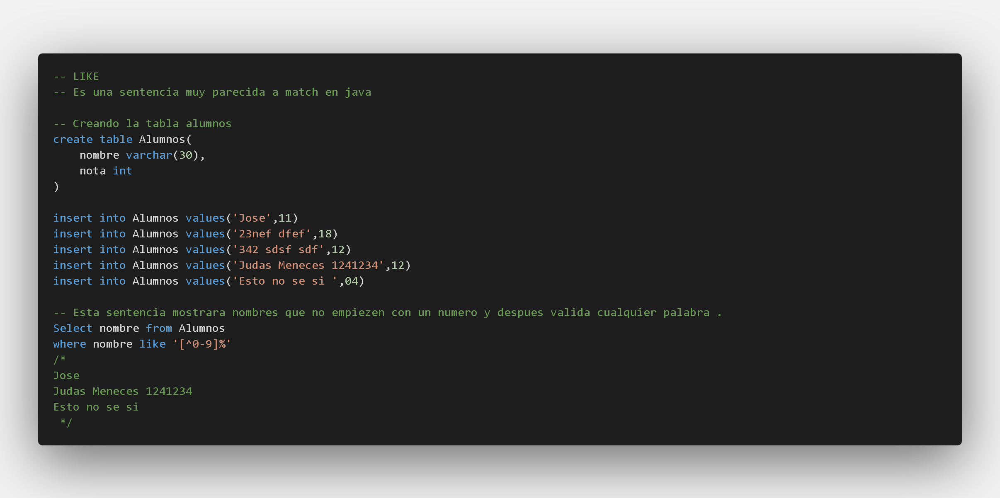
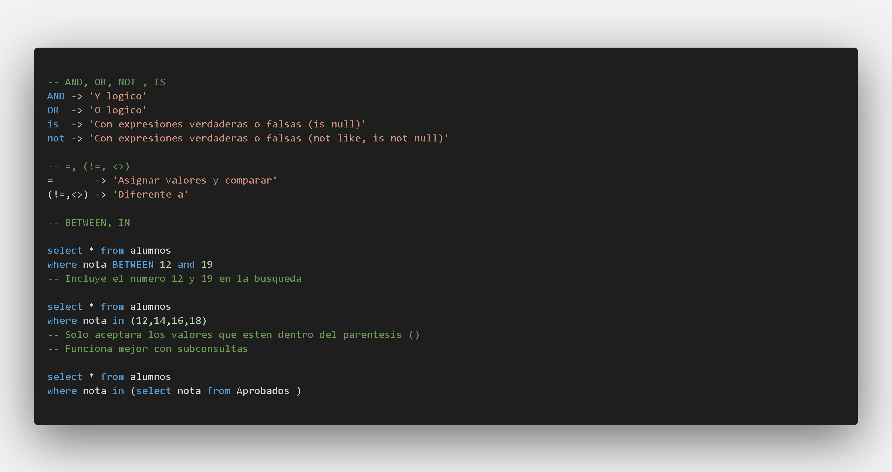

### Operadores Logicos y comparaciones 
#### LIKE

| % | _ | [ ] | [ ^ ] | - |
|:---|:---:|:---:|:---:|---:|
|Representa una cadena cualquiera|Representa un caracter cualquiera|Funciona como un logico| O logico y negativo|Indica una amplitud(0-9)|

### between, in y operadores logicos

