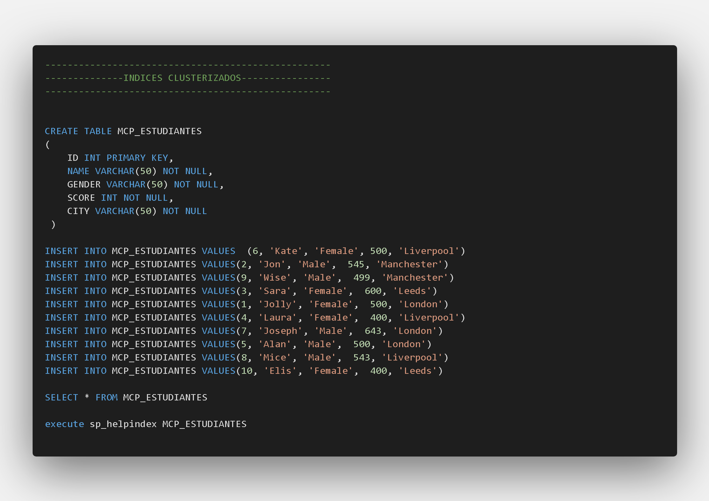
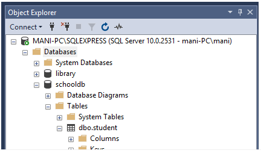
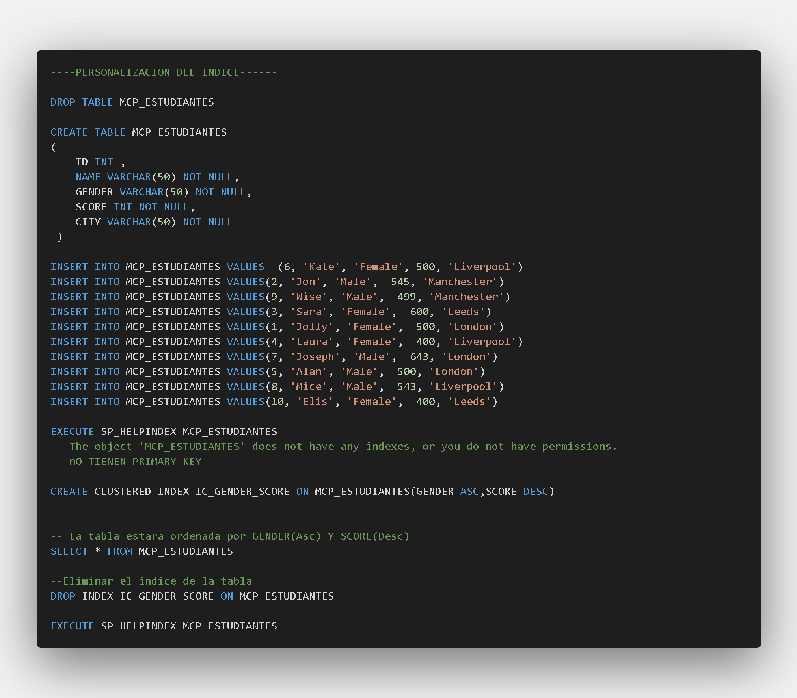
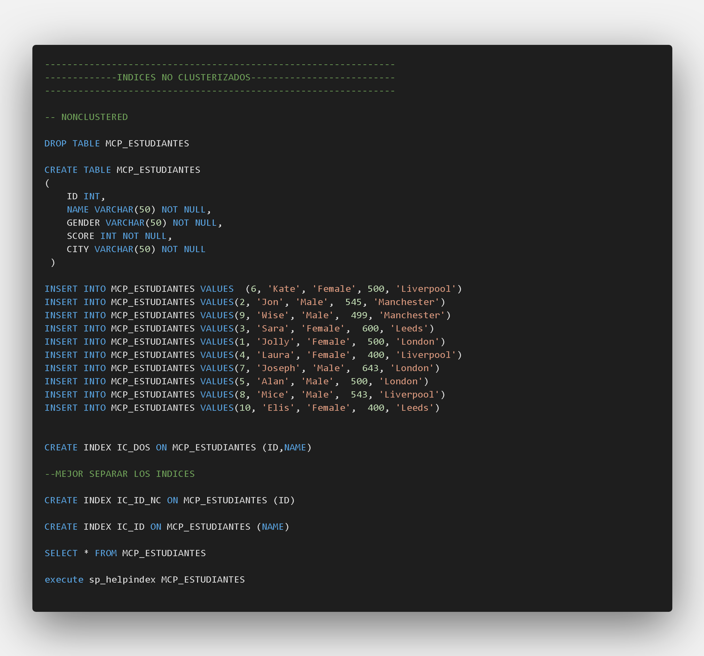

## Indices
### Indices clusterizados o Agrupados

Output

|index_name|index_description|_index_keys|
|:---:|:---:|:---:|
|PK__MCP_Estu...|clustered,... on PRIMARY|ID|

Otra manera de ver índices de tablas es yendo a “Object Explorer->Databases->Database_Name->Tables->Table_Name -> Indexes”. Vea la siguiente captura de pantalla para referencia. 

OUTPUT

|index_name|index_description|_index_keys|
|:---:|:---:|:---:|
|IC_GENDER_SCORE|clustered loc... PRIMARY|GENDER, SCORE|
### Indice no Agrupados

OUTPUT

|index_name |index_description|index_keys|
|:--- | :---: | ---: |
|IC_DOS |nonclustered loc... PRIMARY|ID, NAME|
|IC_ID  |nonclustered loc... PRIMARY|NAME|
|IC_ID_NC|nonclustered loc...  PRIMARY|ID|

### Conclusión

De la discusión encontramos las siguientes diferencias entre índices agrupados y no agrupados.

1. Puede haber sólo un índice agrupado por tabla. De todos modos, usted puede crear múltiples índices no agrupados en una sola tabla.
2. Los índices agrupados sólo ordenan tablas. Por lo tanto, no consumen almacenaje extra. Los índices no agrupados son almacenados en un lugar separado de la tabla real. Reclamando más espacio de almacenamiento.
3. Los índices agrupados son más rápidos que los índices no agrupados, ya que no involucran ningún paso extra de búsqueda.

