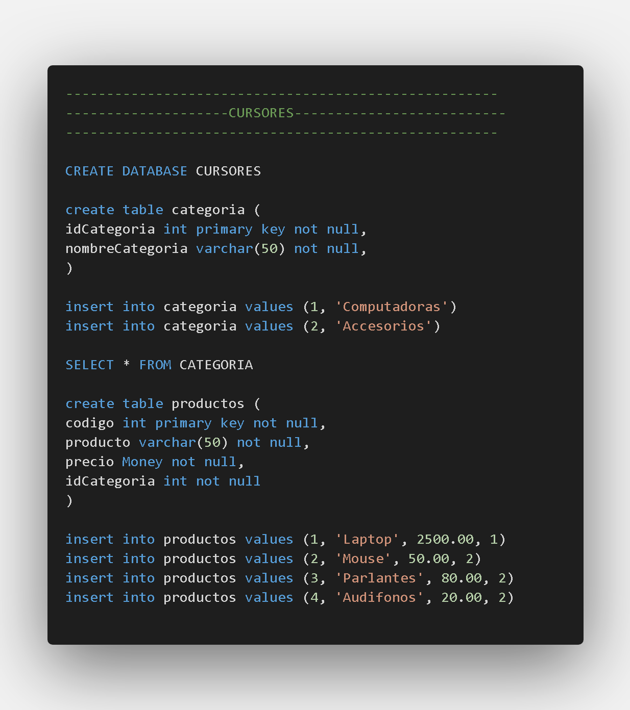
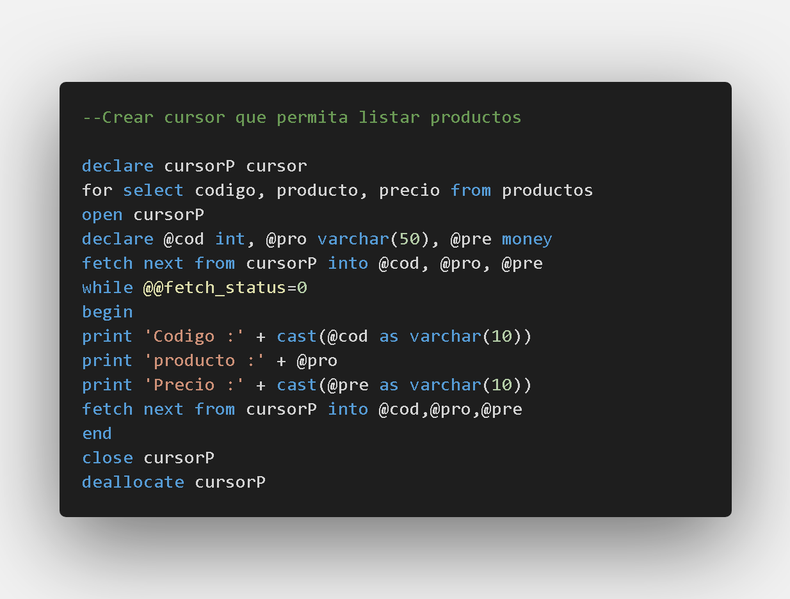
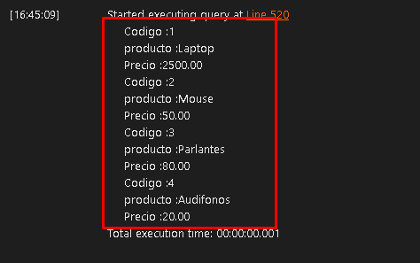
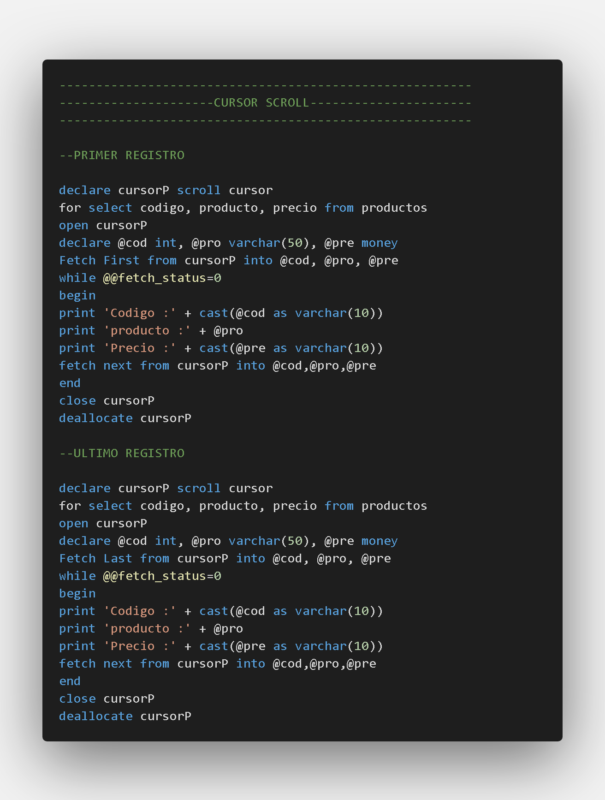
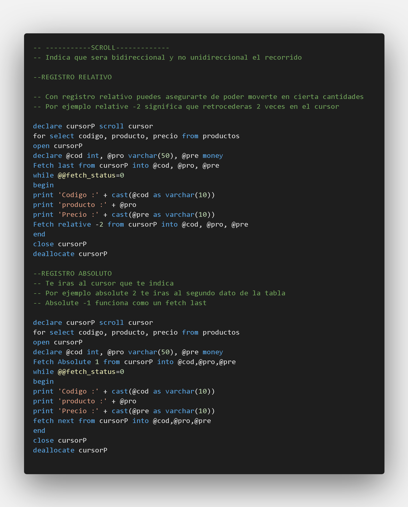
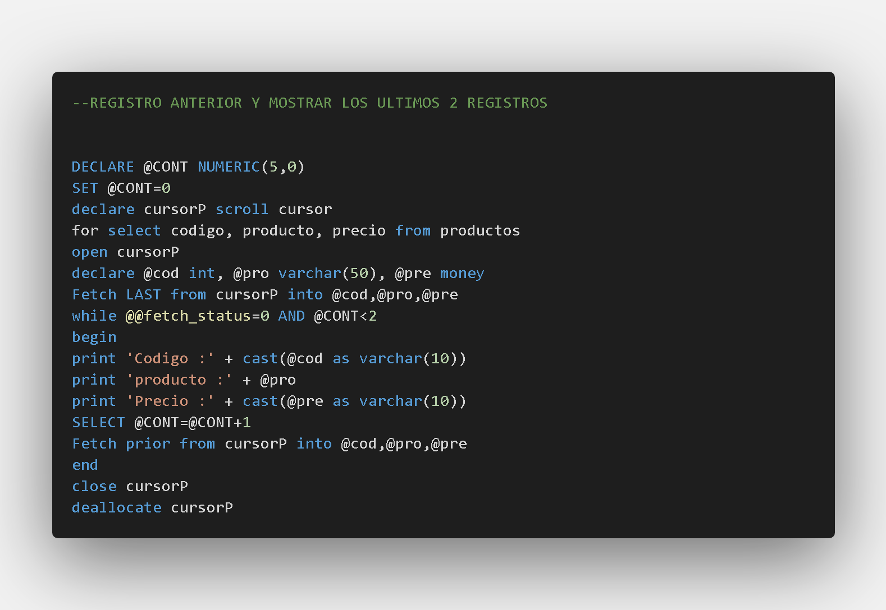
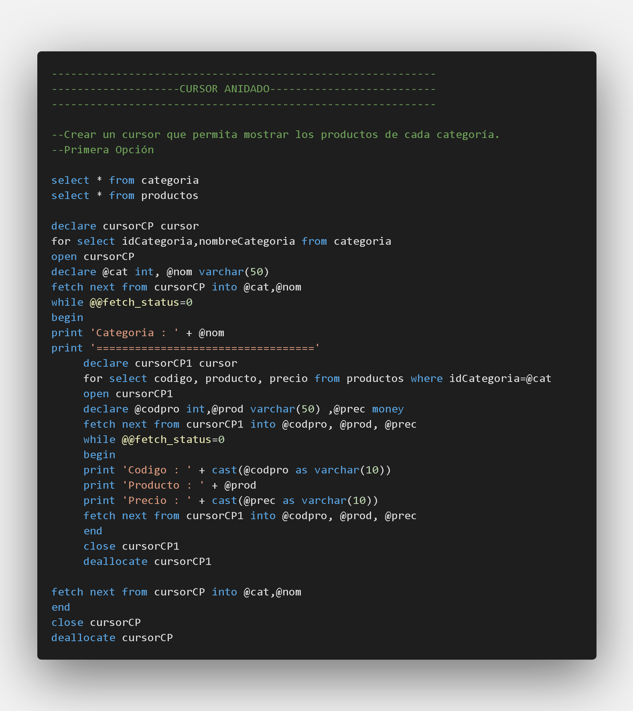
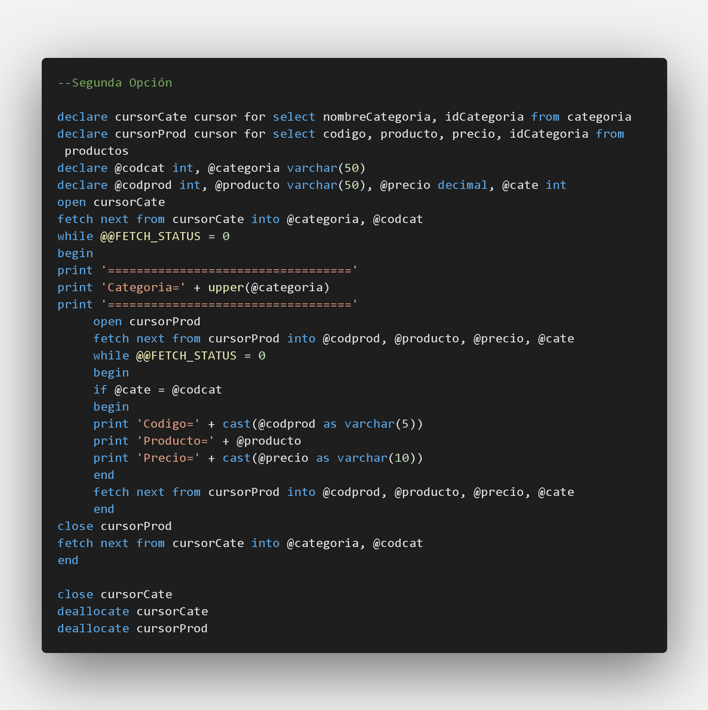
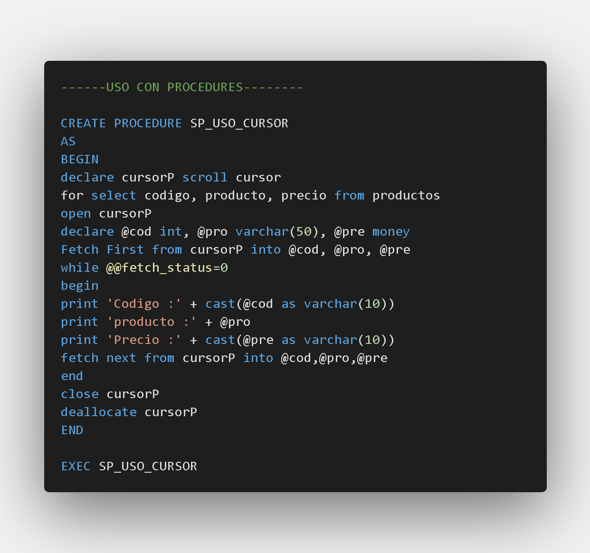

## Cursores
#### Creacion de las tablas 

#### Creacion del cursor

#### Primer y ultimo registro

#### Registro Relativo y absoluto

#### Registro Anterior y mostrar n ultimos registros

#### Cursor Anidado(1era opcion)

#### Cursor Anidado(2da opcion)

#### Cursor con procedure
 

